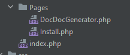
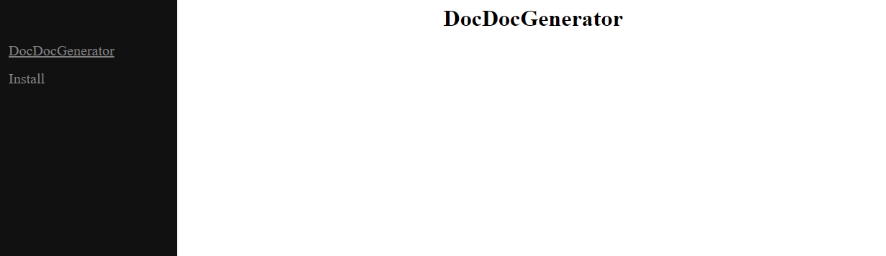

# DocDocGenerator
## Simple documentation viewer using DocGenerator.


Put All you DocGenerator Doc in a `Pages` folder:




Create simple documentation with `index.php`: 

````php
<?php

use App\Kernel;

require dirname(__DIR__).'/vendor/autoload.php';

$documentation = new Kernel();

$documentation->setTitle('DocDocGenerator');
$documentation->loadMenu([
    'DocDocGenerator' => 'DocDocGenerator',
    'Install' => 'Install'
]);

$documentation->render();

````

Profit !

